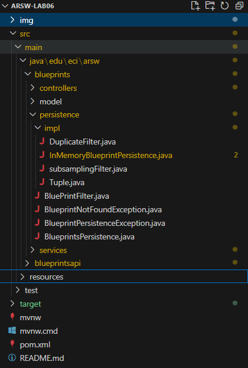
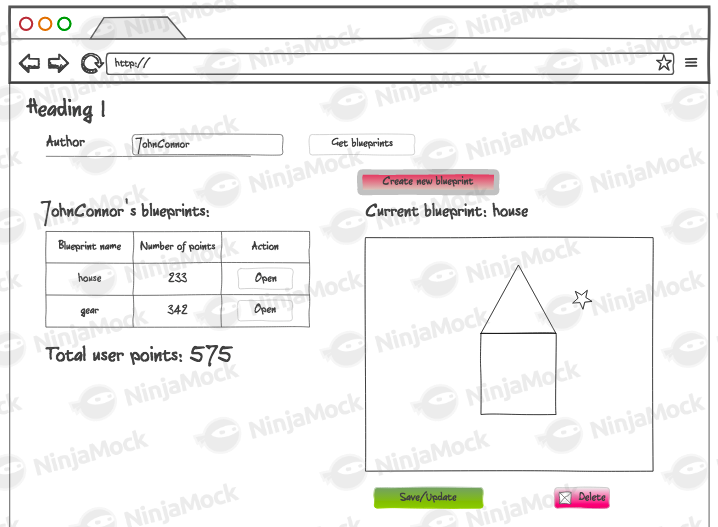
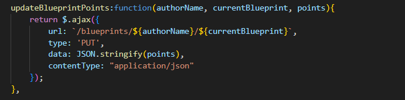
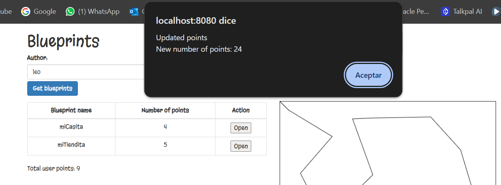

### Escuela Colombiana de Ingeniería
### Arquiecturas de Software

## Construción de un cliente 'grueso' con un API REST, HTML5, Javascript y CSS3. Parte I.

### Trabajo individual o en parejas. A quienes tuvieron malos resultados en el parcial anterior se les recomienda hacerlo individualmente.


* Al oprimir 'Get blueprints', consulta los planos del usuario dado en el formulario. Por ahora, si la consulta genera un error, sencillamente no se mostrará nada.
* Al hacer una consulta exitosa, se debe mostrar un mensaje que incluya el nombre del autor, y una tabla con: el nombre de cada plano de autor, el número de puntos del mismo, y un botón para abrirlo. Al final, se debe mostrar el total de puntos de todos los planos (suponga, por ejemplo, que la aplicación tienen un modelo de pago que requiere dicha información).
* Al seleccionar uno de los planos, se debe mostrar el dibujo del mismo. Por ahora, el dibujo será simplemente una secuencia de segmentos de recta realizada en el mismo orden en el que vengan los puntos.


## Ajustes Backend

1. Trabaje sobre la base del proyecto anterior (en el que se hizo el API REST).



R/: Se toma lo realizado en el laboratorio 5 en cuanto a la parte del back.

2. Incluya dentro de las dependencias de Maven los 'webjars' de jQuery y Bootstrap (esto permite tener localmente dichas librerías de JavaScript al momento de construír el proyecto):

    ```xml
    <dependency>
        <groupId>org.webjars</groupId>
        <artifactId>webjars-locator</artifactId>
    </dependency>

    <dependency>
        <groupId>org.webjars</groupId>
        <artifactId>bootstrap</artifactId>
        <version>3.3.7</version>
    </dependency>

    <dependency>
        <groupId>org.webjars</groupId>
        <artifactId>jquery</artifactId>
        <version>3.1.0</version>
    </dependency>                

    ```
    

R/: Se agregan las depencias correspondientes al pom.xml

## Front-End - Vistas

1. Cree el directorio donde residirá la aplicación JavaScript. Como se está usando SpringBoot, la ruta para poner en el mismo contenido estático (páginas Web estáticas, aplicaciones HTML5/JS, etc) es:  

    ```
    src/main/resources/static
    ```

R/: Se crea el directorio como se indica


2. Cree, en el directorio anterior, la página index.html, sólo con lo básico: título, campo para la captura del autor, botón de 'Get blueprints', campo <div> donde se mostrará el nombre del autor seleccionado, [la tabla HTML](https://www.w3schools.com/html/html_tables.asp) donde se mostrará el listado de planos (con sólo los encabezados), y un campo <div> donde se mostrará el total de puntos de los planos del autor. Recuerde asociarle identificadores a dichos componentes para facilitar su búsqueda mediante selectores.


3. En el elemento \<head\> de la página, agregue las referencia a las librerías de jQuery, Bootstrap y a la hoja de estilos de Bootstrap. 
    ```html
    <head>
        <title>Blueprints</title>
        <meta charset="UTF-8">
        <meta name="viewport" content="width=device-width, initial-scale=1.0">

        <script src="/webjars/jquery/jquery.min.js"></script>
        <script src="/webjars/bootstrap/3.3.7/js/bootstrap.min.js"></script>
        <link rel="stylesheet"
          href="/webjars/bootstrap/3.3.7/css/bootstrap.min.css" />
    </head>
    ```


4. Suba la aplicación (mvn spring-boot:run), y rectifique:
    1. Que la página sea accesible desde:
    ```
    http://localhost:8080/index.html
    ```
    2. Al abrir la consola de desarrollador del navegador, NO deben aparecer mensajes de error 404 (es decir, que las librerías de JavaScript se cargaron correctamente).


R/: Se accede exitosamente a la URL sin errores en consola

## Front-End - Lógica

1. Ahora, va a crear un Módulo JavaScript que, a manera de controlador, mantenga los estados y ofrezca las operaciones requeridas por la vista. Para esto tenga en cuenta el [patrón Módulo de JavaScript](https://toddmotto.com/mastering-the-module-pattern/), y cree un módulo en la ruta static/js/app.js .


2. Copie el módulo provisto (apimock.js) en la misma ruta del módulo antes creado. En éste agréguele más planos (con más puntos) a los autores 'quemados' en el código.


3. Agregue la importación de los dos nuevos módulos a la página HTML (después de las importaciones de las librerías de jQuery y Bootstrap):
    ```html
    <script src="js/apimock.js"></script>
    <script src="js/app.js"></script>
    ```


3. Haga que el módulo antes creado mantenga de forma privada:
    * El nombre del autor seleccionado.
    * El listado de nombre y tamaño de los planos del autor seleccionado. Es decir, una lista objetos, donde cada objeto tendrá dos propiedades: nombre de plano, y número de puntos del plano.

    Junto con una operación pública que permita cambiar el nombre del autor actualmente seleccionado.


R/: Se agrega la operación para cambiar el nombre del autor seleccionado (setAuthor) la cuál modifica el valor de la variable global privada authorName

4. Agregue al módulo 'app.js' una operación pública que permita actualizar el listado de los planos, a partir del nombre de su autor (dado como parámetro). Para hacer esto, dicha operación debe invocar la operación 'getBlueprintsByAuthor' del módulo 'apimock' provisto, enviándole como _callback_ una función que:

    * Tome el listado de los planos, y le aplique una función 'map' que convierta sus elementos a objetos con sólo el nombre y el número de puntos.

    * Sobre el listado resultante, haga otro 'map', que tome cada uno de estos elementos, y a través de jQuery agregue un elemento \<tr\> (con los respectvos \<td\>) a la tabla creada en el punto 4. Tenga en cuenta los [selectores de jQuery](https://www.w3schools.com/JQuery/jquery_ref_selectors.asp) y [los tutoriales disponibles en línea](https://www.tutorialrepublic.com/codelab.php?topic=faq&file=jquery-append-and-remove-table-row-dynamically). Por ahora no agregue botones a las filas generadas.

    * Sobre cualquiera de los dos listados (el original, o el transformado mediante 'map'), aplique un 'reduce' que calcule el número de puntos. Con este valor, use jQuery para actualizar el campo correspondiente dentro del DOM.


R/: Con el llamado a la api obtenemos la lista de todos los planos del autor seleccionado (blueprintsData). Posteriormente a esta lista se le aplica un map, creando así una nueva lista (blueprints) pero cada objeto tendrá solo el nombre del plano y la cantidad de puntos. Posteriormente a blueprints se le aplica otro map resultando en una lista de elementos HTML donde cada uno será una fila en la tabla de planos, obteniendo de cada uno su nombre y la cantidad de puntos. Finalmente se calcula el total de puntos que tiene el autoraplicando la función reduce, la cuál recorre cada plano y acumula en la variable sum la sumatoria de la cantidad de puntos. Dicha variable inicia en 0 (especificado en el segundo parametro de reduce)

5. Asocie la operación antes creada (la de app.js) al evento 'on-click' del botón de consulta de la página.


R/: Se crea el evento asociado al clickeo del botón de busqueda, el cuál ejecuta una función que obtiene el nombre del autor, se asigna a la variable de authorName y finalmente llena la lista de planos de dicho autor.

6. Verifique el funcionamiento de la aplicación. Inicie el servidor, abra la aplicación HTML5/JavaScript, y rectifique que al ingresar un usuario existente, se cargue el listado del mismo.


## Para la próxima semana

8. A la página, agregue un [elemento de tipo Canvas](https://www.w3schools.com/html/html5_canvas.asp), con su respectivo identificador. Haga que sus dimensiones no sean demasiado grandes para dejar espacio para los otros componentes, pero lo suficiente para poder 'dibujar' los planos.


R/: Se crea el emento canvas con una dimensión de 500 por 500 píxeles

9. Al módulo app.js agregue una operación que, dado el nombre de un autor, y el nombre de uno de sus planos dados como parámetros, haciendo uso del método getBlueprintsByNameAndAuthor de apimock.js y de una función _callback_:
    * Consulte los puntos del plano correspondiente, y con los mismos dibuje consectivamente segmentos de recta, haciendo uso [de los elementos HTML5 (Canvas, 2DContext, etc) disponibles](https://www.w3schools.com/html/tryit.asp?filename=tryhtml5_canvas_tut_path)* Actualice con jQuery el campo <div> donde se muestra el nombre del plano que se está dibujando (si dicho campo no existe, agruéguelo al DOM).


R/: Se crea la función drawBlueprint la cuál llama a la api para obtener el plano dado el nombre de este y su autor, luego verifica que el objeto se encontró, en caso de que si obtiene el canvas, lo limpia y empieza a dar trazos teniendo en cuenta las coordenadas de cada punto, hasta llegar al punto final de la lista points.  

10.  Verifique que la aplicación ahora, además de mostrar el listado de los planos de un autor, permita seleccionar uno de éstos y graficarlo. Para esto, haga que en las filas generadas para el punto 5 incluyan en la última columna un botón con su evento de clic asociado a la operación hecha anteriormente (enviándo como parámetro los nombres correspondientes).


R/: Ahora cuando se listan los planos se agrega el botón para abrir el dibujo, relacionando al botón con su correspondiente evento 

11.    Verifique que la aplicación ahora permita: consultar los planos de un autor y graficar aquel que se seleccione.


12. Una vez funcione la aplicación (sólo front-end), haga un módulo (llámelo 'apiclient') que tenga las mismas operaciones del 'apimock', pero que para las mismas use datos reales consultados del API REST. Para lo anterior revise [cómo hacer peticiones GET con jQuery](https://api.jquery.com/jquery.get/), y cómo se maneja el esquema de _callbacks_ en este contexto.


R/: Se crean las dos operaciones que realizan la petición get a la ruta correspondiente del API REST, cuando son exitosas se envía la función callback con la información a la app, la cuál renderiza ya sea la lista de planos o el plano dibujado

13.  Modifique el código de app.js de manera que sea posible cambiar entre el 'apimock' y el 'apiclient' con sólo una línea de código.


R/: Se crea la variable api la cuál se puede cambiar entre apliclient o apimock, para cambiar entre la API REST o el back temporal 

14.  Revise la [documentación y ejemplos de los estilos de Bootstrap](https://v4-alpha.getbootstrap.com/examples/) (ya incluidos en el ejercicio), agregue los elementos necesarios a la página para que sea más vistosa, y más cercana al mock dado al inicio del enunciado.


#### Escuela Colombiana de Ingeniería
#### Procesos de desarrollo de software - PDSW
#### Construción de un cliente 'grueso' con un API REST, HTML5, Javascript y CSS3. Parte II.




1. Agregue al canvas de la página un manejador de eventos que permita capturar los 'clicks' realizados, bien sea a través del mouse, o a través de una pantalla táctil. Para esto, tenga en cuenta [este ejemplo de uso de los eventos de tipo 'PointerEvent'](https://mobiforge.com/design-development/html5-pointer-events-api-combining-touch-mouse-and-pen) (aún no soportado por todos los navegadores) para este fin. Recuerde que a diferencia del ejemplo anterior (donde el código JS está incrustado en la vista), se espera tener la inicialización de los manejadores de eventos correctamente modularizado, tal [como se muestra en este codepen](https://codepen.io/hcadavid/pen/BwWbrw).


R/: Como podemos ver, al momento de iniciar el canvas, hemos agregado los manejadores de eventos, en este caso donde el pointerdown se encarga de manejar los ocurridos en una pantalla tactil, mientras que el mousedown se va a encargar al momento que el usuario utilice el mouse.

2. Agregue lo que haga falta en sus módulos para que cuando se capturen nuevos puntos en el canvas abierto (si no se ha seleccionado un canvas NO se debe hacer nada):
	1. Se agregue el punto al final de la secuencia de puntos del canvas actual (sólo en la memoria de la aplicación, AÚN NO EN EL API!).
    
    
    

    R/: En este caso hemos hecho esta implementación por medio de 3 metodos, donde el primero va a capturar la posición donde se dio click, el segundo se va a encargar de añadir el punto en la posición capturada por el metodo anterior y el tercero va a dibujar el segmento desde el ultimo punto hasta el nuevo. Teniendo estos tres, ya podemos hacer el llamado del handleCanvasClick dentro del init para que se puedan agregar nuevos puntos una vez el usuario ingresa al canvas de un plano.

	2. Se repinte el dibujo.
    
    Antes:

    
    
    Despues:

    

    R/: Como podemos ver ya es posible repintar planos por medio de segmentos.

3. Agregue el botón Save/Update. Respetando la arquitectura de módulos actual del cliente, haga que al oprimirse el botón:
	1. Se haga PUT al API, con el plano actualizado, en su recurso REST correspondiente.

    

    

    

    R/: Hacemos uso de ajax para hacer la petición PUT, de igual forma en la app llamamos al metodo update, en donde haciendo uso de promesas manejamos el orden en que se va a ejecutar, de forma que primero actualice en el back y luego se pueda visualizar en el front el cambio realizo.

	2. Se haga GET al recurso /blueprints, para obtener de nuevo todos los planos realizados.

    Antes:

    

    Mensaje de confirmación: 
    
    

    Obtiene nuevamente todos los planos con el numero de puntos actualizado:

    

    R/: Vemos como al llamar al metodo de UpdateBlueprintList que es el que maneja las peticiones get de la tabla obtenemos nuevamente la lista actualizada de los planos realizados con los puntos nuevos que se agregaron en este caso.

	3. Se calculen nuevamente los puntos totales del usuario.

    

    R/: Esta sumatoria tambien se actualiza a la par con ayuda del mismo metodo de UpdateBluePrintList, el cual tambien vuelve a hacer la sumatoria total.

	Para lo anterior tenga en cuenta:

	* jQuery no tiene funciones para peticiones PUT o DELETE, por lo que es necesario 'configurarlas' manualmente a través de su API para AJAX. Por ejemplo, para hacer una peticion PUT a un recurso /myrecurso:

	```javascript
    return $.ajax({
        url: "/mirecurso",
        type: 'PUT',
        data: '{"prop1":1000,"prop2":"papas"}',
        contentType: "application/json"
    });
    
	```
	Para éste note que la propiedad 'data' del objeto enviado a $.ajax debe ser un objeto jSON (en formato de texto). Si el dato que quiere enviar es un objeto JavaScript, puede convertirlo a jSON con: 
	
	```javascript
	JSON.stringify(objetojavascript),
	```
	* Como en este caso se tienen tres operaciones basadas en _callbacks_, y que las mismas requieren realizarse en un orden específico, tenga en cuenta cómo usar las promesas de JavaScript [mediante alguno de los ejemplos disponibles](http://codepen.io/hcadavid/pen/jrwdgK).

4. Agregue el botón 'Create new blueprint', de manera que cuando se oprima: 

    


	* Se borre el canvas actual.

    


    R/: usamos un metodo llamado clearCanvas para agilizar la limpiesa del canvas.

	* Se solicite el nombre del nuevo 'blueprint' (usted decide la manera de hacerlo).

    [](img/2.4.5.png)

    [](img/2.4.6.png)

    R/: Al darle al botón de "create new blueprint" nos abre una ventana que nos pide el nombre del nuevo print para el autor en el que nos encontramos parados, al ingresar el nombre, el plano se agrega a la lista de blueprints.
	
	Esta opción debe cambiar la manera como funciona la opción 'save/update', pues en este caso, al oprimirse la primera vez debe (igualmente, usando promesas):
!
	1. Hacer POST al recurso /blueprints, para crear el nuevo plano.
    
    

    R/: De igual forma lo hacemos por medio de ajax, para realizar el post a la parte del controller, para crear un nuevo blueprint.

	2. Hacer GET a este mismo recurso, para actualizar el listado de planos y el puntaje del usuario.
    
    

	


    R/: Dentro de este metodo llamamos al metodo que obtiene la petición POST y tambien al metodo de updateBluePrintList que es el que actualiza el listado de planos y tambien el puntaje, haciendo uso del recurso GET.

5. Agregue el botón 'DELETE', de manera que (también con promesas):
    
    


	* Borre el canvas.

    

    R/: Este metodo, va a borrar el canvas, va a llamar el Delete desde el apiclient para borrar desde el back y hace el recurso GET con el metodo de updateBluePrintList luego de que se haga borrado del back con ayuda de promesas.

	* Haga DELETE del recurso correspondiente.

    
    
    
    

    R/: Realizamos la petición al recurso Delete, para esto fue necesario realizar toda la implementación de esta petición, desde la persistencia hasta el apiclient.

	* Haga GET de los planos ahora disponibles.

    
    

    R/: Vemos como al hacer Delete, se actualiza la lista y se borra el plano correspondiente que en este caso "nuevo plano".

### Criterios de evaluación

1. Funcional
	* La aplicación carga y dibuja correctamente los planos.
	* La aplicación actualiza la lista de planos cuando se crea y almacena (a través del API) uno nuevo.
	* La aplicación permite modificar planos existentes.
	* La aplicación calcula correctamente los puntos totales.
2. Diseño
	* Los callback usados al momento de cargar los planos y calcular los puntos de un autor NO hace uso de ciclos, sino de operaciones map/reduce.
	* Las operaciones de actualización y borrado hacen uso de promesas para garantizar que el cálculo del puntaje se realice sólo hasta cando se hayan actualizados los datos en el backend. Si se usan callbacks anidados se evalúa como R.
